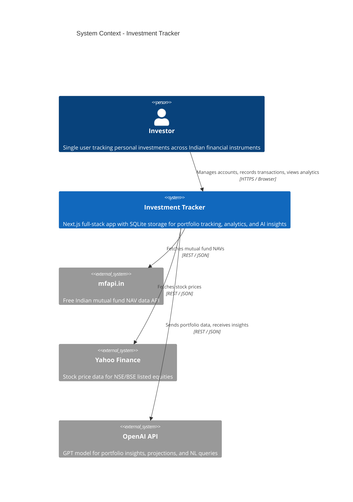

# Investment Tracker - System Context

## System Overview

A personal investment tracking application for Indian financial instruments. The system provides a Next.js web interface for managing investment accounts (bank deposits, stocks, mutual funds, PPF, EPF, NPS, gratuity), recording transactions, viewing performance analytics, and receiving AI-powered financial insights. It runs as a single-user local application with SQLite storage.

## Context Diagram

## External Integrations

- **mfapi.in**: Free mutual fund NAV API for Indian schemes. No API key required. Used to auto-compute MF portfolio values. Risk: Low (free, stable, community-maintained).
- **Yahoo Finance**: Stock price data for NSE/BSE equities. May require API key. Used to auto-compute stock portfolio values. Risk: Medium (rate limits, coverage gaps for Indian markets).
- **OpenAI API**: GPT model for generating portfolio summaries, projections, risk analysis, rebalancing suggestions, and answering natural language queries. Requires API key. Risk: Medium (cost, latency, API changes). App degrades gracefully without it.

## Data Flows

### Inbound
| Source | Data | Format | Frequency |
|--------|------|--------|-----------|
| User (browser) | Account details, transactions, valuations | JSON via API routes | On demand |
| mfapi.in | Mutual fund NAVs | JSON | On demand / periodic |
| Yahoo Finance | Stock prices | JSON | On demand / periodic |
| OpenAI API | Insight responses | JSON | On user request |
| File upload | Backup data (JSON/CSV) | JSON / CSV | On demand |

### Outbound
| Destination | Data | Format | Frequency |
|-------------|------|--------|-----------|
| User (browser) | Dashboard, charts, reports, insights | HTML/JSON (SSR + API) | On demand |
| OpenAI API | Portfolio data prompts | JSON | On user request |
| File download | Backup export | JSON / CSV | On demand |

## High-Level Constraints

- Single-user personal application — no multi-tenancy
- Next.js API routes for backend (monorepo, no separate server)
- SQLite single-file database via Prisma ORM
- All external API keys via environment variables
- App must function without external APIs (graceful degradation)
- Indian financial instruments and INR as primary currency

## Key NFR Goals

- API p95 response time < 300ms
- Dashboard initial render < 2s
- Interest calculations < 100ms per account
- Passphrase-based access control (bcrypt)
- AES-256 app-layer encryption for sensitive fields
- JSON/CSV backup and restore capability
